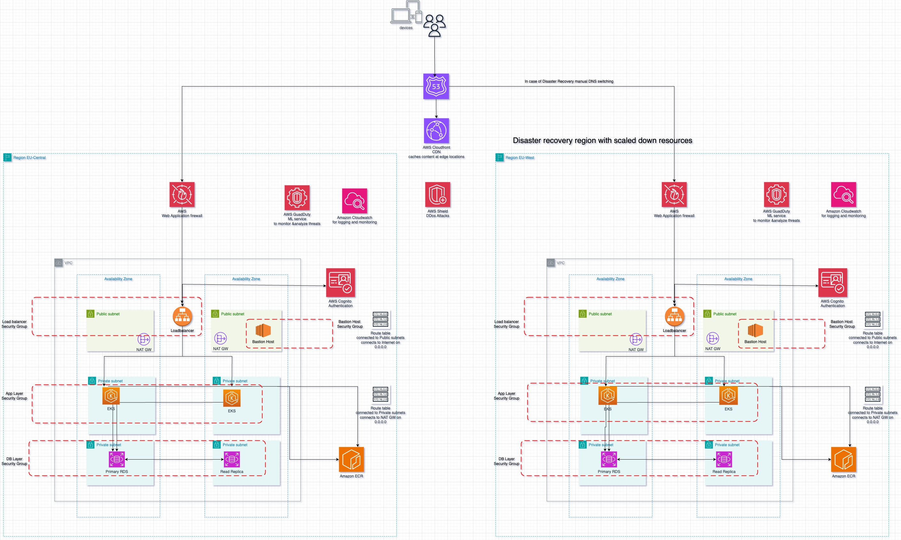

# Password Generator Application

This is a simple REST API application written in Python that generates secure passwords based on user-defined parameters.

## Prerequisites

Before deploying the application, make sure you have the following installed:

- Kubernetes cluster
- Helm
- Docker


## Installation

1. Clone this repository:

    ```bash
    git clone https://github.com/omarmsaber/password-generator.git
    ```

2. Navigate to the `helm-charts` directory:

    ```bash
    cd helm-charts
    ```

3. Install the Helm chart for blue environment:

    ```bash
    helm install password-generator .
    ```

4. To access the application, expose the service as needed by port forwarding the service inside the cluster on port 8000 to your localhost:8080
    ```bash
    kubectl port-forward service/password-generator 8080:8000
    ```

5. To test the application running send the following API request
    
    ```bash
    curl -X POST -H "Content-Type: application/json" -d '{"min_length": 12, "special_chars": 2, "numbers": 3, "num_passwords": 3}' http://localhost:8080/
    ```
6. Optionally, delete the blue deployment and service:

    ```bash
    kubectl delete deployment password-generator
    ```


## Building a new docker image and Pushing the Docker Image

1. Navigate to the root directory and modify line 17 in main.py to     
    ```bash
    return "Welcome to Password Generator blue deployment"
    ```

3. Build the Docker image:

    ```bash
    docker build -t your-docker-username/password-generator:latest .
    ```

4. Push the Docker image to a Docker registry:

    ```bash
    docker push your-docker-username/password-generator:latest
    ```

## Blue-Green Deployment

1. Make changes to the application code then Build and push the new Docker image with a different tag as done in the last section

2. Make changes to the helm configuration navigate to values.yaml and change     
    
    ```yaml
    repository: omarmsaber/password-generator
    tag: "5.0"
    ```
    to your desired values as created in the last step of building your docker image.

3. Install the Helm chart for blue environment:

    ```bash
    helm install password-generator .
    ```

4. Test the blue environment to ensure everything is functioning correctly as it will deployed during the first step as the deployment file (deployment-blue.yaml) was there.
   
   ```bash
    kubectl get deployments
    ```
   you will find the blue-deployment deployment which is the newer version of the app with more replicas and updated image tag

5. Once verified, switch the service to point to the green deployment:

    open the templates/service.yaml and change the selector: app: to the new deployment

6. upgrade the helm chart version

    ```bash
    helm upgrade password-generator .
    ```


7. Optionally, delete the blue deployment and service:

    ```bash
    kubectl delete deployment password-generator
    ```


## Uninstalling the Application

To uninstall the application and delete all associated resources, run:

    ```bash
    helm uninstall password-generator
    ```

# Application Architecture



## Overview of Application Architecture

Our application follows a robust three-tier architecture designed to ensure scalability, reliability, and security. Below are the key components and features of our architecture:

- **Application**: Hosted on Amazon EKS with CDN integration for caching to improve performance and scalability.

- **Backend&DB**: Deployed on Amazon EKS for container orchestration, allowing for scalability and flexibility. It interacts with a relational database managed by Amazon RDS for data persistence. The database is replicated across multiple availability zones for high availability and fault tolerance.

- **Database Replication**: Amazon RDS provides built-in replication features such as Multi-AZ deployments and Read Replicas. Multi-AZ deployments automatically replicate data synchronously across multiple Availability Zones to ensure high availability and durability. Read Replicas can be used to offload read traffic from the primary database instance, improving scalability and performance.

- **Authentication**: Handled by AWS Cognito, providing secure user authentication and authorization.

- **Security**: Utilizes various AWS security services including AWS Shield, AWS GuardDuty, and AWS WAF to protect against DDoS attacks, threats, and web application firewall.

- **Network Infrastructure**: Configured with security groups, NACLs, and route tables to control traffic flow and ensure secure communication within the network. NAT Gateways are employed to provide internet access for private subnets.

- **Logging and Monitoring**: Leveraging AWS CloudWatch for logging and monitoring to gain insights into application performance and troubleshoot issues proactively.

- **IAM (Identity and Access Management)**: IAM roles and policies are used to manage access to AWS resources securely. Best practices include:

  - Principle of Least Privilege: Assign only the permissions necessary for each IAM entity (user, role, group) to perform its intended tasks.
  - Use IAM Roles for Applications: Assign IAM roles to  EKS pods to grant access to AWS resources without hardcoding credentials.
  - Regularly Review and Rotate Credentials: Rotate IAM access keys and credentials periodically to reduce the risk of unauthorized access.
  - Enable MFA (Multi-Factor Authentication): Require users to authenticate using multiple factors (e.g., password and mobile device) to access AWS resources, enhancing security.
  
- **High Availability**: The application is deployed across multiple availability zones within each region for fault tolerance and high availability. Additionally, a Disaster Recovery (DR) application is set up to provide failover capabilities, connected to Route 53 for traffic routing.

This architecture is designed to meet the demands of modern applications, providing scalability, security, and resilience to handle varying workloads and maintain high performance.

For more details on the architecture components, refer to the diagram above.
